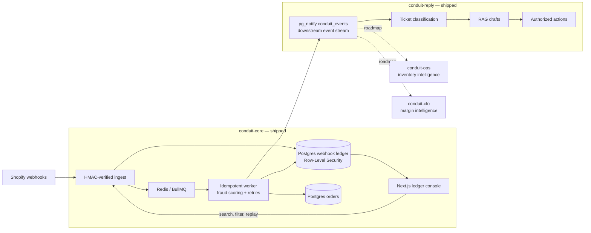

# Conduit-OS

Conduit-OS gives high-growth DTC brands a reliable event-driven AI operating system that turns every commerce event into an auditable, automation-ready business signal.

Built for $5M–$50M brands, it starts with `conduit-core`: a Shopify ingestion ledger that acknowledges webhooks quickly, eliminates duplicate-delivery effects, preserves replayable history, and publishes a stable event stream for future support, inventory, and finance automation.

## In plain English

**The problem:** Every time someone buys something on a Shopify store, Shopify sends a small notification called a "webhook" — think of it as a text message saying "order #4471 just happened." A store's backend systems (inventory, shipping, support, accounting) all rely on receiving that message correctly, exactly once.

At small scale this works fine. But during a huge sale — Black Friday, a viral TikTok moment, a celebrity shoutout — Shopify can fire thousands of these messages a minute. Under that kind of load, ordinary systems start to fail in ways that cost real money:

- **Messages get dropped.** A server gets overwhelmed, doesn't reply fast enough, and Shopify's message disappears. That order silently never enters the store's system — a customer paid, but nothing shipped and nobody noticed until they complained.
- **Messages get duplicated.** Shopify retries messages it thinks failed, even when they actually succeeded. Without safeguards, that can mean charging a customer's shipping twice or double-counting an order in the sales dashboard.
- **Messages arrive out of order.** A "refund" notification can arrive before the "order paid" notification it refers to, confusing systems that expect things to happen in sequence.

For a brand doing $20M/year, a 0.5%–1% failure rate during one big sale isn't a rounding error — it's real orders, real customer complaints, and real support-team hours spent untangling what actually happened.

**What Conduit-Core does about it:** It sits between Shopify and everything downstream as a strict, honest gatekeeper. Every incoming order message is checked for authenticity (so nobody can fake an order), instantly recorded in a permanent, searchable ledger, and processed exactly once — even if Shopify sends the same message five times. Nothing is lost, nothing is double-counted, and every event is visible in a dashboard where a human can see exactly what happened and, if something ever did fail, replay it with one click. It also runs a lightweight fraud check on every order in the background, flagging suspicious ones (mismatched addresses, unusually large carts, disposable email addresses) without slowing anything down.

Think of it less like "an app" and more like a company's accounting ledger for online orders: boring by design, because boring means nothing gets lost, nothing gets double-booked, and there's always a paper trail.

**Why it's the foundation of the whole system:** Conduit-Core is the first of four planned modules. It's built first because everything else — automating customer support, predicting inventory needs, tracking real-time profit margins — depends on having a trustworthy, complete, deduplicated record of what actually happened in the store. Get that record wrong, and every downstream automation inherits the error.

## System architecture



## Verified local benchmark

These are honest local results from the included simulator—not hosted-production claims. It sends 25 signed webhooks at concurrency 10, includes two fraud-pattern payloads, resends five byte-identical deliveries, and polls until processing drains.

| Business concern | Verified result | Why it matters |
|---|---:|---|
| Acknowledgement latency | p50 ~27 ms; steady-state p95 ~36–41 ms | Below the `<100 ms` target in steady state |
| Cold-deploy behavior | Only the first burst showed p95 ~105 ms | Warm-up behavior is visible, not hidden |
| Duplicate deliveries | 5/5 acknowledged as duplicates on every run | Shopify retries do not create duplicate work |
| Duplicate ledger rows | 0 ever created | Database uniqueness backs idempotency |
| Exactly-once materialization | 250 processed ledger events across 10 runs produced exactly 25 order rows | Repeated runs converge on one row per external order |
| Fraud outcome | 1 order fraud-flagged | Deterministic scoring runs in the worker path |
| Processing failures | 0 across all verified runs | The verified runs drained cleanly |
| Authorization | Viewer replay → `403`; Admin replay → `200` | Replay follows role boundaries |
| Authentication | Invalid HMAC → `401` | Untrusted payloads do not enter the ledger |

## Quick start

Requirements: Docker with Compose support.

```bash
# Optional: copy defaults before adding real secrets
cp .env.example .env

# Migrations and demo seed data apply automatically on first boot
docker compose up -d --build
```

Open [http://localhost:3000](http://localhost:3000). The console includes a seeded Owner/Admin/Manager/Viewer role picker.

```bash
# Run the signed Shopify simulator
cd conduit-core/api
npm run simulate

# Run 11 HMAC and fraud-scoring tests
npm test
```

| Service | Host address |
|---|---|
| Next.js console | `http://localhost:3000` |
| Fastify API | `http://localhost:4000` |
| PostgreSQL 15 | `localhost:5433` |
| Redis 7 | `localhost:6380` |

> When running API tools outside Docker, use host ports `5433` and `6380`, not the containers' `5432` and `6379`.

## Modules

| Module | Status | Business problem |
|---|---|---|
| [`conduit-core`](conduit-core/README.md) | **Shipped and verified** | Prevents lost, duplicated, or unauditable events from becoming ghost orders and reconciliation work. |
| [`conduit-reply`](conduit-reply/README.md) | **Shipped and verified** | Automates ticket triage, grounded drafts, and authorized commerce actions so service volume can grow without support payroll growing at the same rate. |
| `conduit-ops` | Roadmap | Releases cash frozen in slow inventory while bestsellers stock out. |
| `conduit-cfo` | Roadmap | Replaces ad-scaling decisions made on stale spreadsheet data with current transaction and margin signals. |

## What ships today

- Fastify ingest with raw-body HMAC-SHA256 verification and 60-second tenant cache.
- PostgreSQL idempotency on `(tenant_id, shopify_event_id)`.
- BullMQ processing with five attempts, exponential backoff, and terminal Slack alerts.
- Tenant-isolated ledger and order materialization protected by PostgreSQL RLS.
- Deterministic fraud scoring with optional Claude escalation.
- `pg_notify('conduit_events', ...)` publication for downstream modules.
- Next.js 14 console with live counts, search, filters, JSON inspection, role selection, and replay.
- Reproducible simulator and 11 passing unit tests.
- `conduit-reply` CRM with asynchronous classification, grounded drafts, role-gated Shopify actions, churn SMS, Agent Copilot, and zero-key fallbacks.

See the [`conduit-core` deep dive](conduit-core/README.md) for API, security, Shopify setup, deployment, and scaling details.
