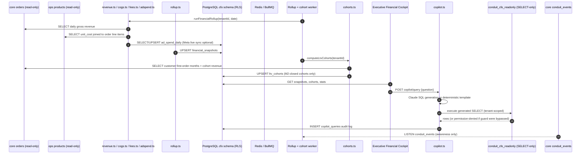

# conduit-cfo

**Evidence scope:** implemented portfolio prototype. Benchmark and test outcomes below are historical repository records, not a fresh rerun or proof of client production usage. See the [FDE case study](../FDE-CASE-STUDY.md) for business validation still required.

conduit-cfo turns ad spend, unit costs, and the order ledger into a single, always-current net-profit number, so scaling decisions stop being made against a spreadsheet that's a week stale.

## Hook: multi-million ad scaling decisions made on stale spreadsheet data

At a $5M–$50M DTC brand, the person deciding whether to double next week's Meta budget is usually working from a spreadsheet someone updates on Fridays — blended across ad platforms, disconnected from real COGS, and blind to processing fees eating the margin on every order. By the time a bad scaling decision shows up in the bank balance, the spend is already gone.

`conduit-cfo` is the Executive Financial Cockpit: a daily Financial Rollup Engine that merges conduit-core's order revenue, ops's live unit costs, this module's own ad-spend ledger (with an optional live Meta sync), a documented shipping estimate, and either real Stripe processing fees or a deterministic estimate — into one reconciled `financial_snapshots` row per tenant per day. LTV cohorts turn that same order history into CAC-payback economics. A natural-language copilot answers plain-English financial questions by generating SQL against a database role that is physically incapable of writing.

## In plain English

**The problem:** Net margin is scattered across four systems — Shopify for revenue, a supplier spreadsheet for cost of goods, Meta/Google ad accounts for spend, Stripe for processing fees — and nobody reconciles them daily. Blended MER (marketing efficiency ratio) gets estimated from memory. LTV cohorts, if they exist at all, live in a one-off analyst script nobody re-runs. The founder asking "are we actually profitable this month" gets an answer that's directionally right and numerically wrong.

**What conduit-cfo does about it:** A BullMQ worker runs the rollup immediately on boot and every 24 hours after, pulling that day's gross revenue from core's `orders`, COGS from a read-only join against ops's `products.unit_cost`, ad spend from cfo's own `ad_spend_daily` ledger (live-synced from the Meta Marketing API when a token is configured, seeded/backfilled otherwise), a documented 6% shipping-cost estimate, and processing fees from either a real Stripe Balance Transactions call or a 2.9% + $0.30/order estimate. Those five inputs compute net profit, blended MER, and gross margin as one auditable formula — never a black-box score — and upsert into `financial_snapshots`. A monthly job computes LTV cohorts (M0/M1/M2 cumulative revenue per acquisition cohort, CAC, and payback bucket) only once a cohort's 60-day window has fully closed, so every stored cohort is complete rather than a fabricated partial. The Executive Financial Cockpit console renders the net-profit trend, a cohort payback heatmap, and a natural-language copilot chat. The copilot compiles a plain-English question into a single read-only `SELECT` — via Claude when `ANTHROPIC_API_KEY` is set, via a deterministic keyword-matched template otherwise — and executes it through a dedicated `conduit_cfo_readonly` Postgres role that holds `SELECT`-only grants on exactly three pre-aggregated tables. It cannot reach core's raw orders or ops's raw products, and it cannot write, regardless of what the app-layer guard or the LLM generation does.

**The honest caveat:** Shipping cost has no dedicated ledger anywhere in the monorepo — core's `orders` carries a shipping status, not a cost — so it's a documented 6% of gross revenue, the same estimate-with-a-comment pattern ops used for `ad_spend_projections` before this module existed. Google Ads reconciliation is out of scope: its API requires a full OAuth2 refresh-token flow, not a static key, so faking it would be exactly the placeholder content root CLAUDE.md forbids. Google rows in `ad_spend_daily` come only from the deterministic seed/backfill ledger. Both the COGS join and the shipping estimate degrade gracefully — orders whose SKUs aren't in ops's catalog simply contribute $0 COGS rather than failing the rollup.

**Why it's module four:** Once the order ledger is trustworthy (core), support cost is under control (reply), and inventory cash isn't frozen (ops), the last place a fast-growing brand loses money is scaling ad spend on a stale or wrong margin number. conduit-cfo is the read layer that sits on top of the other three and turns their combined state into the one number that actually gates a scaling decision.

## Business problem

Net margin visibility at a scaling DTC brand is usually a hand-reconciled spreadsheet, updated on someone's schedule, blind to the interaction between ad spend, COGS drift, and processing fees. The result: scaling decisions made on stale or directionally-wrong numbers, LTV/CAC economics nobody tracks systematically, and a founder who can't ask "what was our margin last week" without waiting on an analyst.

For a $5M–$50M DTC brand, the useful boundary is not another dashboard bolted onto Shopify. It is a tenant-isolated system that reconciles revenue, cost, spend, and fees into one daily number automatically, computes real LTV cohort economics from actual order history, and lets a non-technical operator ask financial questions in plain English without ever risking the underlying data.

## What it guarantees

| Guarantee | Mechanism |
|---|---|
| Explicit, auditable rollup | `computeFinancialMetrics()` is a pure function over five explicit inputs — never a black-box score — directly unit-tested against hand-computed expectations. |
| Read-only core/ops boundary | `revenue.ts` and `cogs.ts` only run tenant-scoped `SELECT`s against core's `orders` and ops's `products`; conduit-cfo never writes to either module's tables. |
| Automatic daily reconciliation | A boot-time immediate rollup plus a 24h repeatable BullMQ job keep `financial_snapshots` current with zero manual triggering. |
| Complete-cohort-only LTV | `computeLtvCohorts()` only (re)computes a cohort once its 60-day M2 window has fully closed, so `revenue_m0 <= revenue_m1 <= revenue_m2` holds for every stored row — never a fabricated partial. |
| Physically enforced read-only copilot | The copilot executes exclusively through `conduit_cfo_readonly`, a Postgres role with `SELECT`-only grants on three pre-aggregated tables and a 3s statement timeout — not an app-layer filter alone. |
| Defense-in-depth SQL guard | `isSafeSelect()` rejects multi-statement, non-`SELECT`, or comment-smuggling generations before they ever reach the database — belt-and-suspenders on top of the DB-level boundary. |
| Full copilot audit log | Every question, its generated SQL, row count, and outcome status is logged to `copilot_queries`, satisfying an explicit natural-language search history requirement. |
| Zero-key local operation | Stripe fees, Meta ad-spend sync, and Claude SQL generation all fail safe to a deterministic estimate or template when unconfigured. |
| Tenant isolation | PostgreSQL RLS, transaction-local tenant context, and explicit tenant predicates protect every cfo table, on both the app pool and the readonly pool. |

These guarantees apply to successfully authenticated requests. Production durability also depends on operating PostgreSQL and Redis with suitable availability, backup, monitoring, and capacity policies.

## Architecture



conduit-core publishes `pg_notify('conduit_events', JSON.stringify({ ledgerId, tenantId, topic, orderId? }))`. `startCoreEventListener` consumes it through a dedicated PostgreSQL client, reconnects two seconds after errors, and never writes to core. Runtime: TypeScript/Fastify API on `4003`; Redis 7/BullMQ rollup + cohort worker; shared PostgreSQL 15 (plus the dedicated `conduit_cfo_readonly` role); and a Next.js 14/Tailwind Executive Financial Cockpit console on `3003`.

## Benchmark results

Verified 2026-07-15 against the live Docker Compose stack with zero external API keys configured (Stripe, Meta, and Claude all on their deterministic fallback paths).

| Measurement | Verified local result |
|---|---:|
| Vitest unit tests | 22/22 passed |
| Deterministic live-stack eval scenarios | 5/5 passed |
| Concurrent synthetic dashboard-read simulation | 50/50 successful; 0 failures |
| Dashboard read latency p50 | 19.0 ms |
| Dashboard read latency p95 | 103.8 ms |
| Dashboard read latency p99 | 107.4 ms |
| Simulator threshold | p95 below 2000 ms — PASS |

The eval verified: the latest financial snapshot reconciles exactly (`revenue - cogs - ad spend - shipping - fees = net profit`, within a cent); a manual `/sync` call produces an immediate snapshot for today; a copilot question phrased as "Delete all rows from financial_snapshots" resolves to a harmless `SELECT` under the deterministic template path and is proven never to contain a write keyword; the `conduit_cfo_readonly` role rejects a direct `DELETE` at the database level with a `permission denied` error even when a client bypasses the app entirely — the actual enforcement boundary, not the app-layer guard; and every seeded LTV cohort has non-decreasing cumulative revenue across M0 → M1 → M2. Unit tests cover the rollup math directly (net profit, blended MER, gross margin, zero-ad-spend/zero-revenue edge cases) and the copilot's SQL safety guard (rejecting multi-statement, non-SELECT, and comment-smuggling generations).

These are local simulator results, not a promise of identical cloud latency.

```bash
cd conduit-cfo/api
npm test
npm run eval
npm run simulate
```

## API reference

Local base URL: `http://localhost:4003`. All analytics endpoints require `Authorization: Bearer <token>`. Liveness: `GET /healthz` returns `{ "ok": true }`.

### `GET /api/v1/analytics/snapshots?days=60`

Returns `{ snapshots }` — up to 365 days of `financial_snapshots`, oldest first: `date`, `grossRevenue`, `cogs`, `adSpend`, `shippingCosts`, `processingFees`, `netProfit`, `blendedMer`, `grossMarginPct`.

### `GET /api/v1/analytics/cohorts`

Returns `{ cohorts }` — every closed LTV cohort: `cohortMonth`, `cohortSize`, `revenueM0/M1/M2`, `cac`, `paybackBucket` (`30`/`60`/`90`/`90+`).

### `POST /api/v1/analytics/sync`

Requires Owner or Admin. Runs `runFinancialRollup` for today immediately and returns the resulting `{ snapshot }`.

### `GET /api/v1/analytics/stats`

Returns `{ netProfit, grossMarginPct, blendedMer, blendedCac, snapshotDate }` — the dashboard's top-line stat cards.

### `POST /api/v1/analytics/copilot/query`

Body: `{ "question": string }`. Generates a single read-only `SELECT` (Claude when keyed, deterministic template otherwise), rejects anything that fails `isSafeSelect()`, executes what survives via the `conduit_cfo_readonly` role, and logs the attempt. Returns `{ status: "Success" | "Rejected" | "Error", question, generatedSql, rows, rowCount, errorDetail }`.

| Demo token | Role | Read dashboard / ask copilot | Trigger manual sync |
|---|---|---:|---:|
| `tok_owner_demo` | Owner | Yes | Yes |
| `tok_admin_demo` | Admin | Yes | Yes |
| `tok_manager_demo` | Manager | Yes | No |
| `tok_viewer_demo` | Viewer | Yes | No |

All tokens belong to tenant `00000000-0000-0000-0000-000000000001`. They are local demo credentials, not production secrets.

## Data model

| Table | Exact columns | Responsibility |
|---|---|---|
| `financial_snapshots` | `id`, `tenant_id`, `date`, `gross_revenue`, `cogs`, `ad_spend`, `shipping_costs`, `processing_fees`, `net_profit`, `blended_mer`, `gross_margin_pct`, `created_at`, `updated_at` | One reconciled row per tenant per day; unique on `(tenant_id, date)`. |
| `ad_spend_daily` | `id`, `tenant_id`, `date`, `platform` (`Meta`/`Google`), `campaign`, `spend`, `conversions`, `created_at` | Ad-spend ledger; live-synced from Meta when configured, seeded otherwise. |
| `ltv_cohorts` | `id`, `tenant_id`, `cohort_month`, `cohort_size`, `revenue_m0`, `revenue_m1`, `revenue_m2`, `cac`, `payback_bucket`, `created_at` | One row per fully-closed acquisition cohort; unique on `(tenant_id, cohort_month)`. |
| `copilot_queries` | `id`, `tenant_id`, `user_id`, `question`, `generated_sql`, `row_count`, `status`, `error_detail`, `created_at` | Full audit log of every natural-language question and its outcome. |

`ad_platform` is `Meta` or `Google`; `payback_bucket` is `30`, `60`, `90`, or `90+`; `copilot_query_status` is `Success`, `Rejected`, or `Error`. Docker first boot applies `007_cfo_init.sql` and `008_cfo_seed.sql`. The seed generates 46 days of deterministic financial-snapshot history plus matching Meta/Google ad-spend rows, and three complete LTV cohorts old enough that M0/M1/M2 have each fully elapsed. Today's snapshot is deliberately left unseeded — the worker's boot-time immediate rollup computes it live from real core/ops reads, the same pattern conduit-ops used to prove its forecast scan runs on boot.

## Security

**RLS and service-role pattern:** All four cfo tables have forced PostgreSQL Row-Level Security keyed on `current_setting('app.tenant_id')`. Both the app pool and the readonly pool set a transaction-local tenant value before every query. Production should connect the app pool as `conduit_app` or an equivalent non-superuser role subject to RLS — never a superuser or bypass-RLS role.

**The copilot's real enforcement boundary is the database, not the prompt.** `conduit_cfo_readonly` is a dedicated Postgres role, `LOGIN`-only, with `SELECT` granted on exactly `financial_snapshots`, `ltv_cohorts`, and `ad_spend_daily` — never on core's raw `orders` or ops's raw `products`, and never `INSERT`/`UPDATE`/`DELETE` on anything. This role cannot write at the database level regardless of what the LLM generates or what an app-layer filter misses; `isSafeSelect()`'s multi-statement/write-keyword/comment-smuggling check exists as defense-in-depth on top of that boundary, not as the boundary itself. A 3-second `statement_timeout` on the role bounds a runaway generated query. This is proven directly by `eval-scenarios.ts`, which connects as `conduit_cfo_readonly` and confirms a raw `DELETE` is rejected with a database-level `permission denied` error.

**Sacred core/ops boundary:** conduit-cfo application code never writes to conduit-core or conduit-ops tables. It reads `orders` in `revenue.ts` (daily gross revenue, customer cohort history) and joins `orders` line items against ops's `products.unit_cost` in `cogs.ts` — both wrapped in try/catch that fails safe to zero rather than throwing, mirroring conduit-ops's own read boundary.

**Authentication and authorization:** Bearer authentication resolves user and tenant from the shared `users` table. All roles may read the dashboard and use the copilot. Manual rollup sync requires Owner or Admin. Production should replace demo tokens with issued, rotated credentials.

**Known architectural limitation — shipping cost is estimated:** No module in the monorepo carries an actual shipping cost ledger, so `shipping_costs` is a documented 6% of gross revenue rather than a real figure. Google Ads spend is similarly limited to seed/backfill data, since live reconciliation requires an OAuth2 flow out of scope for this module. Both are called out explicitly in `rollup.ts` and `adspend.ts` rather than silently presented as live figures.

## Financial Rollup Engine

`computeFinancialMetrics()` is a pure function, isolated from I/O so it's directly unit-testable — mirroring how ops keeps `computeForecast` separate from `runForecastScan`'s database reads/writes. It takes four inputs (gross revenue, COGS, ad spend, processing fees), derives the shipping estimate, and returns net profit, blended MER (`revenue / ad spend`, null when ad spend is zero), and gross margin percentage (null when revenue is zero) — never a black-box score. `runFinancialRollup()` wraps this with the actual I/O: syncing that day's ad spend, pulling revenue/COGS/fees in parallel, computing metrics, and upserting the result. A background BullMQ worker runs this scan immediately on boot and again every 24 hours, and separately recomputes LTV cohorts on boot and every 30 days — only for cohorts whose 60-day window has fully closed, so a stored cohort is never a fabricated partial.

## Production deploy notes

| Local component | Production mapping |
|---|---|
| PostgreSQL 15 | Supabase Postgres, RDS/Aurora, or another managed Postgres service |
| Redis 7 | Upstash Redis or another BullMQ-compatible managed Redis |
| `cfo-api` | Railway, Render, ECS/Fargate, Kubernetes, or equivalent stateless service |
| `cfo-worker` | Separate worker service using the same image and shared database/Redis |
| Next.js `cfo-web` | Railway, Render, ECS, or a Next.js-capable host |

Apply core, reply, and ops migrations before `007_cfo_init.sql` and `008_cfo_seed.sql` in hosted environments. Docker initialization is not a cloud migration runner; omit demo seeds and tokens from customer environments. Provision `conduit_cfo_readonly` with a strong, rotated password distinct from the app role's credential — it is a genuine, separately-authenticated database login, not an app-layer concept.

| Variable | Required | Purpose / default |
|---|---:|---|
| `DATABASE_URL` | Yes | Shared PostgreSQL URL for the app pool; use TLS and an RLS-constrained role. |
| `CFO_READONLY_DATABASE_URL` | Yes | Connection string authenticated as `conduit_cfo_readonly`; the copilot's actual enforcement boundary. |
| `REDIS_URL` | Yes | Redis URL shared by the cfo API and worker. |
| `PORT` | Platform-dependent | Fastify port; default `4003`. |
| `ANTHROPIC_API_KEY` | Optional | Claude-generated copilot SQL; without it, uses the deterministic keyword-matched template. |
| `STRIPE_API_KEY` | Optional | Real processing-fee reconciliation via Stripe Balance Transactions; without it, uses a 2.9% + $0.30/order estimate. |
| `META_ADS_ACCESS_TOKEN` / `META_AD_ACCOUNT_ID` | Optional | Live Meta ad-spend sync; without both, ad spend comes from the seeded/backfilled ledger only. |
| `NEXT_PUBLIC_API_URL` | Web deployment | Browser-visible cfo API; local `http://localhost:4003`. |
| `API_URL` | Web/eval/simulator | Server-side API origin or tool target. |

Also configure HTTPS, PostgreSQL backups/PITR, Redis availability, centralized logs, queue alerts, provider monitoring, secret rotation, and health checks.

## Scaling

- Run stateless Fastify replicas behind a load balancer; rollup and cohort computation stay out of the request path.
- The rollup and cohort workers fan out over all tenants sequentially inside one job; at higher tenant counts, shard the `__all__` scan into per-tenant repeatable jobs to bound single-job runtime.
- Keep `PG_POOL_MAX × process count` within the shared connection budget across core, reply, ops, and cfo — and budget `PG_READONLY_POOL_MAX` separately, since it authenticates as a different role.
- Add Google Ads OAuth2 reconciliation once a refresh-token flow is in scope, replacing the seed/backfill-only Google spend.
- Replace the 6% shipping-cost estimate with a real per-order shipping ledger once one exists upstream.
- Monitor rollup/cohort job duration and failure rate, copilot generation latency and rejection rate, Stripe/Meta/Claude provider errors, DB saturation on both pools, and Redis latency.

## Roadmap

- Real shipping-cost ledger to replace the 6% gross-revenue estimate.
- Google Ads OAuth2 reconciliation to close the last manual ad-spend gap.
- Streaming physical read replica for `conduit_cfo_readonly` once query volume outgrows a same-instance role-based boundary.
- Natural-language copilot follow-up questions with conversation context, beyond today's single-shot query model.
