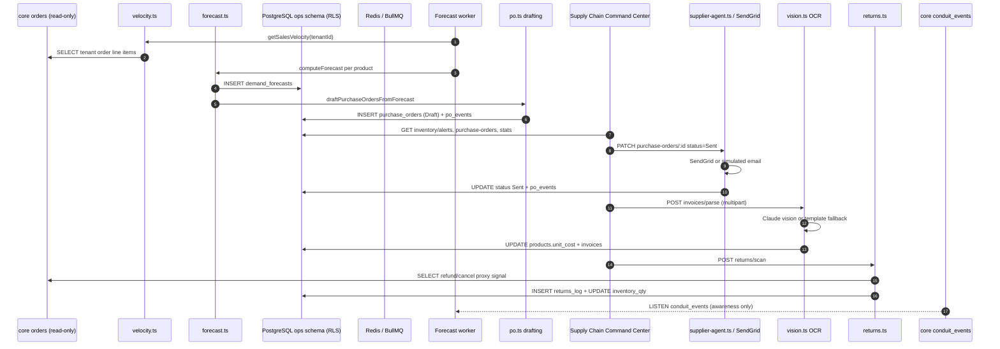

# conduit-ops

**Evidence scope:** implemented portfolio prototype. Benchmark and test outcomes below are historical repository records, not a fresh rerun or proof of client production usage. See the [FDE case study](../FDE-CASE-STUDY.md) for business validation still required.

conduit-ops keeps cash from freezing in the wrong inventory by predicting stockouts before they happen and drafting the purchase order to fix them automatically.

## Hook: cash frozen in slow inventory while bestsellers stock out

At scaling DTC brands, growth marketing outruns supply chain visibility. A launch spikes demand on one SKU while last quarter's slow mover sits in a warehouse tying up cash. Reorder decisions are made from a spreadsheet someone updates when they remember to, and by the time a stockout shows up in Shopify, the sale — and the ad spend that drove it — is already lost.

`conduit-ops` turns conduit-core's trusted order stream into a Predictive Supply Chain & ERP Engine. It computes a per-SKU sales velocity from real order history, forecasts depletion dates against lead time and safety stock, auto-drafts purchase orders sized to cover the gap, emails them to the supplier, ingests supplier invoices to keep unit costs current, and reconciles returns back into on-hand inventory. Every optional integration — Claude vision OCR, SendGrid email — has a deterministic or simulated fallback, so the full local workflow runs with zero external API keys.

## In plain English

**The problem:** Nobody notices a stockout coming. Inventory managers reorder off memory and gut feel, usually triggered by someone noticing a product page says "out of stock" — which means the lost sales already happened. On the other side, cash sits locked in SKUs nobody's buying, because there's no systematic signal telling anyone to stop reordering them. Both failure modes come from the same root cause: nobody is turning sales velocity into a forward-looking number.

Most inventory tools either require a full ERP migration or bolt a dashboard onto Shopify that shows current stock levels — a rearview mirror, not a forecast. They don't factor in supplier lead time, they don't account for a marketing push about to 3x demand on a SKU, and they definitely don't draft the purchase order for you.

**What conduit-ops does about it:** It reads the same trustworthy order ledger conduit-core keeps, derives real per-SKU sales velocity from actual line items, and combines it with each product's lead time, safety stock limit, and upcoming ad-spend projection into an explicit, logged forecast — not a black box. When a SKU crosses its safety threshold or is projected to deplete within two weeks, it shows up as an alert with a suggested reorder quantity, and a background worker auto-drafts a Purchase Order grouped by supplier, sized to the supplier's MOQ. An Owner or Admin reviews it in the Supply Chain Command Center and marks it Sent — which fires an actual (or simulated) email to the supplier — then Received, which restocks inventory automatically. Supplier invoices can be uploaded and OCR'd to keep unit costs current, with a deterministic template fallback when no vision API key is configured. A returns router reconciles refunded/cancelled orders back into on-hand stock.

**The honest caveat:** conduit-cfo — the module that will own real advertising spend data — doesn't exist yet, so `ad_spend_projections` is a seeded, clearly documented synthetic stand-in until it can be replaced with a live feed. Core also has no dedicated returns/refund webhook topic, so "returns" are proxied from order rows whose payment or shipping status indicates a refund or cancellation — a documented best-effort signal, not a real returns feed. The forecast math, PO drafting, and invoice OCR fallback all work correctly regardless; only the ad-spend input and the returns signal are approximations until upstream modules exist to feed them for real.

**Why it's module three:** Once the order ledger (conduit-core) is trustworthy and support cost is under control (conduit-reply), the next place operating cash actually leaks is inventory — money sitting in the wrong SKUs while the right ones stock out during the exact moments marketing is driving traffic to them.

## Business problem

Inventory planning at fast-growing DTC brands is usually a spreadsheet someone updates by hand, disconnected from real sales velocity, supplier lead time, and upcoming demand. The result is cash frozen in overstocked SKUs, stockouts on bestsellers during peak demand, manual purchase-order drafting, and unit costs that drift out of date because nobody re-keys supplier invoices.

For a $5M–$50M DTC brand, the useful boundary is not another spreadsheet template. It is a tenant-isolated system that continuously forecasts depletion from real order data, drafts and dispatches purchase orders without manual data entry, keeps costs current from supplier invoices, and reconciles returns — while staying operational when optional providers are unavailable.

## What it guarantees

| Guarantee | Mechanism |
|---|---|
| Explicit, auditable forecasts | Every forecast input (sales history, sample size, ad-spend volatility) contributes an explicit logged `ForecastSignal`, never a black-box score. |
| Read-only core boundary | `velocity.ts` and `returns.ts` only run tenant-scoped `SELECT`s against core's `orders` table; conduit-ops never writes to core tables. |
| Automatic reorder coverage | A boot-time scan plus a 24h repeatable BullMQ job recompute forecasts and auto-draft Purchase Orders sized to lead time + 14 days of coverage, floored at the supplier MOQ. |
| Role-gated purchase-order and supply actions | Only Owner and Admin may create, transition, or send purchase orders, trigger a returns scan, or parse an invoice. |
| A parse result is always available | Invoice OCR always returns line items — Claude vision when `ANTHROPIC_API_KEY` is set and the file is an image, a deterministic regex template otherwise. |
| Validated uploads | Invoice uploads are checked against an explicit MIME allowlist, a 10 MB size cap, and magic-byte signature verification before ever touching disk. |
| Tenant isolation | PostgreSQL RLS, transaction-local tenant context, and explicit tenant predicates protect every ops table. |
| Zero-key local operation | Claude vision and SendGrid fail safe to a deterministic template or simulated send. |

These guarantees apply to successfully authenticated requests. Production durability also depends on operating PostgreSQL and Redis with suitable availability, backup, monitoring, and capacity policies.

## Architecture



conduit-core publishes `pg_notify('conduit_events', JSON.stringify({ ledgerId, tenantId, topic, orderId? }))`. `startCoreEventListener` consumes it through a dedicated PostgreSQL client, reconnects two seconds after errors, and never writes to core. Runtime: TypeScript/Fastify API on `4002`; Redis 7/BullMQ forecast worker; shared PostgreSQL 15; and a Next.js 14/Tailwind/Recharts Supply Chain Command Center on `3002`.

## Benchmark results

The verified run rebuilt the full stack from a genuinely empty Docker volume (`docker compose down -v && docker compose up -d --build`) on 2026-07-15 with **zero external API keys configured**, confirming both the forecast worker's boot-time scan and the migration/seed files apply correctly on first init.

| Measurement | Verified local result |
|---|---:|
| Vitest unit tests | 10/10 passed |
| Deterministic live-stack eval scenarios | 4/4 passed |
| Concurrent synthetic dashboard-read simulation | 50/50 successful; 0 failures |
| Dashboard read latency p50 | 18.8 ms |
| Dashboard read latency p95 | 106.9 ms |
| Dashboard read latency p99 | 122.2 ms |
| Simulator threshold | p95 below 2000 ms — PASS |
| Post-run ERP stats | 1 open purchase order; 1 active alert; average forecast confidence 0.233; $3,250.00 total forecasted reorder value |

The eval verified: the seeded low-stock SKU (`TUM-24-STL`, 42 units on hand against a 150-unit safety limit) produces an inventory alert with a positive suggested reorder quantity; a Draft purchase order auto-drafts with a total that exactly matches the sum of `quantity × unitCost` across its line items and respects the supplier's 500-unit MOQ; the returns scan endpoint is well-formed and idempotent (a second scan logs zero duplicate entries); and a plain-text invoice upload parses through the deterministic template fallback with the exact seeded quantity and unit cost. Unit tests cover the forecast math directly: velocity-driven depletion dates, reorder quantity growth as inventory drops or lead time grows, MOQ enforcement, the safety-stock-deficit fallback when there's no sales history, the ad-spend multiplier and its cap, and confidence scoring.

These are local simulator results, not a promise of identical cloud latency.

```bash
cd conduit-ops/api
npm test
npm run eval
npm run simulate
```

## API reference

Local base URL: `http://localhost:4002`. All ERP endpoints require `Authorization: Bearer <token>`. Liveness: `GET /healthz` returns `{ "ok": true }`.

### `GET /api/v1/erp/inventory/alerts`

Returns `{ alerts }` — one row per product currently at or below its safety stock limit, or forecast to deplete within 14 days. Each alert includes `productId`, `sku`, `title`, `inventoryQty`, `safetyStockLimit`, `predictedDepletionDate`, `suggestedReorderQty`, and `confidenceScore`.

### `GET /api/v1/erp/products` / `GET /api/v1/erp/suppliers`

List views backing the dashboard's alert and supplier panels.

### `POST /api/v1/erp/purchase-orders`

Requires Owner or Admin. Manually drafts a PO.

```json
{ "supplierId": "<uuid>", "items": [{ "productId": "<uuid>", "sku": "TUM-24-STL", "title": "Insulated Steel Tumbler 24oz", "quantity": 500, "unitCost": 6.5 }] }
```

Returns `201` with the created PO; `totalAmount` is computed server-side from `quantity × unitCost`.

### `GET /api/v1/erp/purchase-orders` / `GET /api/v1/erp/purchase-orders/:id`

List, or fetch one PO with its full `po_events` audit trail.

### `PATCH /api/v1/erp/purchase-orders/:id`

Requires Owner or Admin. Body: `{ "status": "Sent" | "Received" | "Closed", "trackingUrl"?: string }`. `Sent` calls the supplier email agent; `Received` increments `products.inventory_qty` per line item; every transition logs a `po_events` row.

### `POST /api/v1/erp/invoices/parse`

Requires Owner or Admin. Multipart upload (`file`, optional `supplierId` field). Accepts `image/jpeg`, `image/png`, `application/pdf`, or `text/plain` (the last exists only for the deterministic demo/eval path), enforces a 10 MB cap and magic-byte validation, and returns `{ invoiceId, status, source, lineItems }` where `source` is `claude-vision` or `template`. Matched SKUs update `products.unit_cost`.

### `GET /api/v1/erp/invoices`

Optional `status` query filter. Returns `{ invoices }`.

### `POST /api/v1/erp/returns/scan`

Requires Owner or Admin, no body. Scans core's `orders` for refund/cancel signals not already logged, inserts `returns_log` rows, and restocks matched products. Returns `{ scanned, logged }`.

### `GET /api/v1/erp/stats`

Returns `{ openPurchaseOrders, activeAlerts, avgConfidence, totalForecastedReorderValue }`.

| Demo token | Role | Read dashboard | Manage POs / returns scan / invoice parse |
|---|---|---:|---:|
| `tok_owner_demo` | Owner | Yes | Yes |
| `tok_admin_demo` | Admin | Yes | Yes |
| `tok_manager_demo` | Manager | Yes | No |
| `tok_viewer_demo` | Viewer | Yes | No |

All tokens belong to tenant `00000000-0000-0000-0000-000000000001`. They are local demo credentials, not production secrets.

## Data model

| Table | Exact columns | Responsibility |
|---|---|---|
| `suppliers` | `id`, `tenant_id`, `name`, `email`, `lead_time_days`, `moq`, `created_at` | Supplier directory and reorder constraints. |
| `products` | `id`, `tenant_id`, `supplier_id`, `title`, `sku` (unique per tenant), `inventory_qty`, `safety_stock_limit`, `unit_cost`, `created_at` | SKU inventory state and reorder thresholds. |
| `purchase_orders` | `id`, `tenant_id`, `supplier_id`, `status`, `items` (jsonb), `total_amount`, `tracking_url`, `created_at`, `updated_at` | Draft-through-Closed PO lifecycle. |
| `po_events` | `id`, `tenant_id`, `purchase_order_id`, `event_type`, `detail` (jsonb), `created_at` | Audit trail for drafting, sending, receiving, closing, and invoice parses. |
| `demand_forecasts` | `id`, `tenant_id`, `product_id`, `forecast_date`, `predicted_depletion_date`, `suggested_reorder_qty`, `confidence_score`, `created_at` | Forecast history per product per scan. |
| `ad_spend_projections` | `id`, `tenant_id`, `product_id`, `week_start`, `projected_spend_usd`, `created_at` | Synthetic stand-in for conduit-cfo's future ad-spend feed; seeded fixture only. |
| `invoices` | `id`, `tenant_id`, `supplier_id`, `file_path`, `status`, `parsed_line_items` (jsonb), `created_at` | Uploaded supplier invoices and their OCR results. |
| `returns_log` | `id`, `tenant_id`, `product_id`, `source_order_id` (text, no FK — read-only proxy against core), `qty`, `reason`, `defective`, `created_at` | Logged return/cancellation signals and their inventory impact. |

`po_status` is `Draft`, `Sent`, `Received`, or `Closed`; `invoice_status` is `Pending`, `Parsed`, or `Failed`; `po_event_type` is `Drafted`, `Sent`, `Shipping_Update`, `Received`, `Closed`, or `Invoice_Parsed`. Docker first boot applies `005_ops_init.sql` and `006_ops_seed.sql`. The seed contains 2 suppliers, 6 products (one — `TUM-24-STL` — deliberately below its safety stock limit), and synthetic ad-spend projections for two SKUs across three weeks.

## Security

**RLS and service-role pattern:** All eight ops tables have forced PostgreSQL Row-Level Security keyed on `current_setting('app.tenant_id')`. Tenant operations use a transaction-local tenant value and explicit predicates. Production should connect as `conduit_app` or an equivalent non-superuser role subject to RLS — never a superuser or bypass-RLS role.

**Sacred core boundary:** conduit-ops application code never writes to conduit-core tables. It reads `orders` in exactly two tenant-scoped `SELECT` paths — `velocity.ts` (sales velocity from `raw_data->'line_items'`) and `returns.ts` (the refund/cancel proxy signal) — both wrapped in try/catch that fails safe to an empty result rather than throwing.

**Upload validation:** Invoice uploads are checked against an explicit MIME allowlist, a 10 MB size limit, and a magic-byte signature check (JPEG/PNG/PDF) before being written to disk under a per-tenant directory. `text/plain` is explicitly excluded from magic-byte validation because it exists only for the deterministic demo/eval fixture path, not real invoice ingestion.

**Authentication and authorization:** Bearer authentication resolves user and tenant from the shared users table. All roles may read the dashboard. Purchase-order creation and status transitions, the returns scan trigger, and invoice parsing require Owner or Admin — stricter than conduit-reply's action gating, matching the higher blast radius of committing real supplier spend. Production should replace demo tokens with issued, rotated credentials.

**Known architectural limitation — ad-spend is synthetic:** `ad_spend_projections` is seeded fixture data, not a live marketing feed, because conduit-cfo (the module that will own real ad-spend) does not exist yet. `forecast.ts` treats it as one weighted signal among several, never as ground truth, and the forecast degrades gracefully to safety-stock-deficit logic when velocity data is absent.

## Predictive Forecasting Engine

`computeForecast()` mirrors conduit-core's fraud scorer style: every input contributes an explicit, logged `ForecastSignal` rather than a black-box regression. Base velocity comes from actual units sold over a 30-day window; an ad-spend multiplier (capped at 2.5x) adjusts it upward when a marketing push is projected. If adjusted velocity is positive, the engine projects a depletion date and sizes the reorder to cover lead time plus 14 days, floored at the supplier's MOQ. If there's no velocity signal at all, it falls back to a pure safety-stock-deficit reorder so a brand-new SKU still gets a sane suggestion. A background BullMQ worker runs this scan immediately on boot and again every 24 hours, then auto-drafts one Draft PO per supplier for every product that needs reordering.

## Production deploy notes

| Local component | Production mapping |
|---|---|
| PostgreSQL 15 | Supabase Postgres, RDS/Aurora, or another managed Postgres service |
| Redis 7 | Upstash Redis or another BullMQ-compatible managed Redis |
| `ops-api` | Railway, Render, ECS/Fargate, Kubernetes, or equivalent stateless service |
| `ops-worker` | Separate worker service using the same image and shared database/Redis |
| Next.js `ops-web` | Railway, Render, ECS, or a Next.js-capable host |
| Invoice uploads volume | Object storage (S3-compatible) behind a signed-URL flow, replacing the local Docker volume |

Apply core and reply migrations before `005_ops_init.sql` and `006_ops_seed.sql` in hosted environments. Docker initialization is not a cloud migration runner; omit demo seeds and tokens from customer environments.

| Variable | Required | Purpose / default |
|---|---:|---|
| `DATABASE_URL` | Yes | Shared PostgreSQL URL; use TLS and an RLS-constrained role. |
| `REDIS_URL` | Yes | Redis URL shared by the ops API and worker. |
| `PORT` | Platform-dependent | Fastify port; default `4002`. |
| `ANTHROPIC_API_KEY` | Optional | Claude vision invoice OCR; without it, uses the deterministic regex template. |
| `SENDGRID_API_KEY` | Optional | Real supplier PO emails; incomplete config simulates sends. |
| `SENDGRID_FROM_EMAIL` | Optional | SendGrid sender address, paired with the API key. |
| `UPLOADS_DIR` | Optional | Invoice upload storage path; default `/app/uploads`. |
| `NEXT_PUBLIC_API_URL` | Web deployment | Browser-visible ops API; local `http://localhost:4002`. |
| `API_URL` | Web/eval/simulator | Server-side API origin or tool target. |

Also configure HTTPS, PostgreSQL backups/PITR, Redis availability, centralized logs, queue alerts, provider monitoring, secret rotation, and health checks.

## Scaling

- Run stateless Fastify replicas behind a load balancer; forecast computation stays out of the request path.
- The forecast worker fans out over all tenants sequentially inside one job; at higher tenant counts, shard the `__all__` scan into per-tenant repeatable jobs to bound single-job runtime.
- Keep `PG_POOL_MAX × process count` within the shared connection budget across core, reply, and ops.
- Replace the local invoice-upload volume with object storage before running more than a single `ops-api` replica, since local disk isn't shared across instances.
- Add a dedicated ad-spend ingestion path once conduit-cfo ships, replacing the synthetic `ad_spend_projections` fixture with a live feed.
- Monitor forecast-scan duration and failure rate, PO-drafting throughput, email/OCR provider errors, DB saturation, and Redis latency.

## Roadmap

- Replace `ad_spend_projections` with a live feed from conduit-cfo once it ships.
- Add a dedicated core webhook topic for refunds/cancellations so `returns.ts` no longer needs to proxy from `payment_status`/`shipping_status`.
- Shipping-tracking webhook ingestion to auto-transition `Sent` → `Received` instead of requiring a manual status update.
- Per-tenant sharded forecast scheduling once tenant volume outgrows a single sequential `__all__` job.
