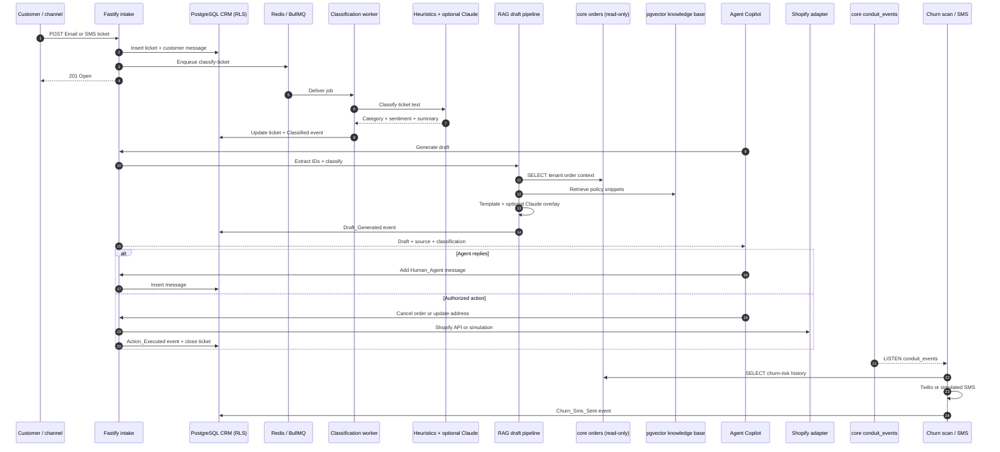

# conduit-reply

**Evidence scope:** implemented portfolio prototype. Benchmark and test outcomes below are historical repository records, not a fresh rerun or proof of client production usage. See the [FDE case study](../FDE-CASE-STUDY.md) for business validation still required.

conduit-reply keeps support response volume growing without support headcount growing at the same rate by automating ticket triage, grounded drafts, safe commerce actions, and churn-prevention outreach.

## Hook: support payroll is the fastest-growing cost center

At scaling DTC brands, every campaign, launch, and shipping disruption creates more order-status, cancellation, return, and address-change conversations. Hiring agents in direct proportion to ticket volume makes growth expensive and leaves customers waiting during peak moments.

`conduit-reply` turns conduit-core's trusted customer and order history into an Omnichannel Agentic CRM. It accepts Email and SMS tickets, classifies them asynchronously, generates policy- and order-grounded drafts, lets authorized agents execute Shopify actions, and runs a churn-prevention SMS loop. Every optional integration has a deterministic or simulated fallback, so the full local workflow runs with zero external API keys.

## In plain English

**The problem:** As a store grows, so does its inbox. "Where's my order," "I need to cancel," "this arrived damaged," "can you change my shipping address" — the same handful of questions, over and over, at a volume that scales with sales. The obvious fix is to hire more support agents, but payroll for a support team grows in a straight line right alongside order volume, and it never catches up to the spikes around a big launch or a sale.

Most "AI support" tools bolt a chatbot onto a help desk. The bot doesn't actually know if order #4471 shipped, can't see the customer's real order history, and can't safely take an action like cancelling an order or fixing an address — so a human still has to do the real work, and the chatbot just adds a layer of frustration in front of it.

**What conduit-reply does about it:** It reads the same trustworthy order ledger that conduit-core keeps, so every reply it drafts is grounded in real facts — the actual order status, the actual tracking number, the actual return policy — instead of a guess. When a ticket comes in, it's filed instantly so the customer isn't kept waiting, then sorted in the background into a category (order status, cancellation, return, complaint, and so on) and handed a first-draft reply built from a template and the real order data. A human agent reviews that draft in a simple three-pane workspace, edits it if needed, and — if they have the right permissions — can let the system actually execute the fix (cancel the order, update the address) with one click, instead of switching over to Shopify and doing it by hand. Every one of those automated actions is logged, so there's always a record of what the system did and why.

It also runs a quiet background check for customers who've gone quiet — people who ordered before but haven't in over a month and a half — and sends them a retention message automatically, catching churn before it happens instead of after.

**The honest caveat:** Like conduit-core, this runs with zero paid API keys out of the box so it's fully demoable offline — but that means the "search the policy documents" feature falls back to a non-semantic matching method when no OpenAI key is configured (documented in detail under Security below). The ticket classification, drafting, and action-taking all work correctly regardless; only true semantic policy search needs a real key.

**Why it's module two:** Support tickets are the most direct, highest-frequency place a brand's operating cost shows up as headcount. Automating it well — without ever letting the system act blindly — is the highest-leverage second step once the order ledger underneath it (conduit-core) can be trusted.

## Business problem

Support systems often split customer messages, order context, policies, and commerce actions across separate tools. Agents copy identifiers between tabs, rewrite repetitive replies, and manually perform changes in Shopify. The result is higher payroll, slower responses, inconsistent policy application, and weak auditability.

For a $5M–$50M DTC brand, the useful boundary is not another chatbot. It is a tenant-isolated workflow that acknowledges intake quickly, classifies work off the request path, grounds replies in known policy and order facts, constrains write actions by role, records automation, and stays operational when optional providers are unavailable.

## What it guarantees

| Guarantee | Mechanism |
|---|---|
| Fast ticket intake | Intake stores the ticket and message, enqueues BullMQ classification, and returns without waiting for classification or an LLM. |
| Asynchronous classification | Workers apply deterministic heuristics first, with an optional Claude overlay. |
| A draft response path is always available | A deterministic template is built first; optional LLM refinement cannot block the fallback. |
| Role-gated autonomous actions | Only Owner, Admin, and Manager may cancel orders or update addresses; accepted executions create an auditable `Action_Executed` event. |
| PII protection before external LLM calls | Card, SSN, CVV, and password patterns are scrubbed before ticket text reaches Claude. |
| Tenant isolation | PostgreSQL RLS, transaction-local tenant context, and explicit tenant predicates protect CRM records. |
| Zero-key local operation | Claude, OpenAI, Twilio, and Shopify fail safe to deterministic or simulated behavior. |
| Read-only core boundary | Application code only reads tenant-scoped order context from conduit-core and never mutates core tables. |

These guarantees apply to successfully authenticated requests. Production durability also depends on operating PostgreSQL and Redis with suitable availability, backup, monitoring, and capacity policies.

## Architecture



conduit-core publishes `pg_notify('conduit_events', JSON.stringify({ ledgerId, tenantId, topic, orderId? }))`. `startCoreEventListener` consumes it through a dedicated PostgreSQL client, reconnects two seconds after errors, and never writes to core. Runtime: TypeScript/Fastify API on `4001`; Redis 7/BullMQ workers; shared PostgreSQL 15 with pgvector; and a Next.js 14/Tailwind Agent Copilot Workspace on `3001`.

## Benchmark results

The verified session ran against the live seeded Docker stack on 2026-07-15 with **zero external API keys configured**.

| Measurement | Verified local result |
|---|---:|
| Vitest unit tests | 10/10 passed |
| Deterministic live-stack eval scenarios | 4/4 passed |
| Concurrent synthetic ticket simulation | 50/50 successful; 0 failures |
| Ingest acknowledgement p50 | 41.3 ms |
| Ingest acknowledgement p95 | 119.3 ms |
| Ingest acknowledgement p99 | 136.7 ms |
| Simulator threshold | p95 below 2000 ms — PASS |
| Post-simulation CRM stats | 66 tickets; auto-resolution rate 1; handoff ratio 0; average latency 9 ms; LLM cost $0 |

The eval verified: an order-status draft referencing order `1054` and tracking number `1Z999AA10123456784`; cancellation classification; negative-sentiment classification; and return classification with a well-formed template draft. Unit tests cover PII scrubbing, embedding reproducibility/fallback, and draft templates.

These are local simulator results, not a promise of identical cloud latency.

```bash
cd conduit-reply/api
npm test
npm run eval
npm run simulate
```

## API reference

Local base URL: `http://localhost:4001`. All CRM endpoints require `Authorization: Bearer <token>`. Liveness: `GET /healthz` returns `{ "ok": true }`.

### `POST /api/v1/crm/tickets`

Creates a ticket and first customer message, then enqueues classification.

```json
{ "customerId": "cust_demo_1054", "channel": "Email", "body": "Where is order #1054?" }
```

`channel` must be `Email` or `SMS`; `body` must be non-empty. Success returns `201` with `{ "id": "<uuid>", "status": "Open", "createdAt": "<timestamp>" }`.

### `GET /api/v1/crm/tickets`

Returns `{ tickets, total, counts }`; counts contain `open`, `pendingHuman`, and `closed`. Optional exact filters: `status` and `channel`; pagination: `limit` (default 50, maximum 200) and `offset` (default 0). Ticket fields are `id`, `customerId`, `channel`, `status`, `sentiment`, `category`, `summary`, `createdAt`, and `updatedAt`.

### `GET /api/v1/crm/tickets/:id`

Returns `{ ticket, messages }`. Messages are oldest first with `id`, `ticketId`, `senderType`, `body`, and `createdAt`. Missing or cross-tenant IDs return `404`.

### `POST /api/v1/crm/tickets/:id/messages`

Adds a Human Agent message from `{ "body": "<non-empty text>" }`. Success returns the message with `201`; a missing ticket returns `404`.

### `POST /api/v1/crm/tickets/:id/generate-draft`

Accepts no body. It reads customer messages, extracts order IDs, performs tenant-scoped core order lookups, retrieves policy snippets, classifies text, builds a template, and optionally overlays Claude. Returns `{ "draft": "<text>", "source": "template", "classification": { ... } }`; `source` is `template` or `llm`. A missing ticket returns `404`.

### `POST /api/v1/crm/tickets/:id/execute-action`

Requires Owner, Admin, or Manager. Supported bodies:

```json
{ "action": "cancel_order", "externalOrderId": "1054" }
```

```json
{ "action": "update_shipping_address", "externalOrderId": "1054", "newAddress": { "address1": "10 Main St", "city": "Austin", "province": "TX", "zip": "78701", "country": "US" } }
```

Returns `{ "result": { "simulated": true, "success": true, "detail": "..." }, "ticketClosed": true }`. Configured Shopify calls set `simulated` to false and report success or failure. Every accepted execution is recorded; Viewer receives `403`.

### `POST /api/v1/crm/churn/scan`

Requires Owner or Admin and accepts no body. Finds customers with at least two orders whose latest order is more than 45 days old, sends or simulates retention SMS, and returns `{ "scanned": <number>, "smsSent": <number> }`.

### `GET /api/v1/crm/stats`

Returns `{ totalTickets, autoResolutionRate, handoffRatio, avgLatencyMs, totalLlmCostUsd }`. Rates are ratios from `0` to `1`; latency is rounded to milliseconds.

### `POST /api/v1/crm/knowledge-base/sync`

Requires Owner or Admin. Upserts documents by tenant and title, embedding through OpenAI when configured or the deterministic fallback otherwise.

```json
{ "docs": [{ "title": "Return Policy", "content": "Items may be returned within 30 days." }] }
```

Returns `{ "synced": 1 }`. Every document needs non-empty `title` and `content`.

| Demo token | Role | Read / draft | Action | KB sync / churn scan |
|---|---|---:|---:|---:|
| `tok_owner_demo` | Owner | Yes | Yes | Yes |
| `tok_admin_demo` | Admin | Yes | Yes | Yes |
| `tok_manager_demo` | Manager | Yes | Yes | No |
| `tok_viewer_demo` | Viewer | Yes | No | No |

All tokens belong to tenant `00000000-0000-0000-0000-000000000001`. They are local demo credentials, not production secrets.

## Data model

| Table | Exact columns | Responsibility |
|---|---|---|
| `tickets` | `id`, `tenant_id`, `customer_id`, `channel`, `status`, `sentiment`, `category`, `summary`, `created_at`, `updated_at` | Ticket identity, classification, lifecycle, and customer/channel linkage. |
| `messages` | `id`, `ticket_id`, `tenant_id`, `sender_type`, `body`, `created_at` | Ordered Customer, Human Agent, and AI Agent conversation records. |
| `knowledge_base` | `id`, `tenant_id`, `title`, `content`, `embedding`, `created_at` | Tenant policy documents and 1536-dimensional pgvector embeddings; title is unique per tenant. |
| `ticket_events` | `id`, `tenant_id`, `ticket_id`, `event_type`, `detail`, `llm_cost_usd`, `latency_ms`, `created_at` | Audit trail for classification, drafts, actions, escalation/resolution, and churn SMS. |

`ticket_channel` is `Email` or `SMS`; ticket status is `Open`, `Pending_Human`, or `Closed`; event types are `Classified`, `Draft_Generated`, `Action_Executed`, `Escalated`, `Resolved`, and `Churn_Sms_Sent`. Docker first boot applies `003_reply_init.sql` and `004_reply_seed.sql`. The seed contains order `1054`, one ticket asking about it, and four policy documents.

## Security

**RLS and service-role pattern:** All four CRM tables have forced PostgreSQL Row-Level Security keyed on `current_setting('app.tenant_id')`. Tenant operations use a transaction-local tenant value and explicit predicates. Production should connect as `conduit_app` or an equivalent non-superuser role subject to RLS—never a superuser or bypass-RLS role.

**Sacred core boundary:** Except for the documented one-time fixture insert in `004_reply_seed.sql`, conduit-reply application code never writes to conduit-core tables. It reads `orders` in exactly two tenant-scoped `SELECT` paths: `lookupOrderContext` in `api/src/rag.ts` and the churn-risk query in `api/src/churn.ts`.

**PII and external models:** `scrubPii` redacts Luhn-valid card numbers and SSN, CVV, and password patterns before text reaches Claude. Optional integrations use raw `fetch`, fail safely, and do not make the workflow depend on provider availability.

**Authentication and authorization:** Bearer authentication resolves user and tenant from the shared users table. All roles may read tickets and generate drafts. Shopify actions require Owner, Admin, or Manager; KB sync and manual churn scans require Owner or Admin. Production should replace demo tokens with issued, rotated credentials and verified inbound channels.

**Known architectural limitation — fallback embeddings are not semantic:** When `OPENAI_API_KEY` is unset, `embeddings.ts` creates a deterministic SHA256-hash-based vector with **no semantic relationship to the source text**. This intentionally keeps pgvector cosine-similarity queries executable with zero external calls, but knowledge-base retrieval is not semantically meaningful without a real embedding key. Deterministic ticket classification and template draft generation do not depend on embeddings and work correctly regardless.

## RAG Draft Generation & Autonomous Actions

The pipeline is heuristic-first and template-first. Regex extraction finds order IDs and SKUs; deterministic rules establish category, sentiment, and summary; tenant-scoped reads add order status, carrier, tracking, and delivery context; and pgvector retrieves policy snippets. A complete draft exists before any optional model call. Claude may rewrite it while preserving factual details; if Claude fails or is absent, the template remains the response.

Autonomous actions support `cancel_order` and `update_shipping_address`. Authorized requests call Shopify Admin when both Shopify variables are configured. Without credentials, the adapter returns a successful, explicitly simulated result. Provider failures return a structured unsuccessful result rather than throwing, and the outcome is retained in `ticket_events`.

The churn loop finds customers with at least two orders and a gap over 45 days, then sends a fixed retention offer through Twilio or simulation. A repeatable BullMQ job runs the all-tenant scan every six hours; Owner/Admin may trigger a tenant scan through the API.

## Production deploy notes

| Local component | Production mapping |
|---|---|
| PostgreSQL 15 + pgvector | Supabase Postgres, RDS/Aurora with pgvector, or another managed pgvector-capable service |
| Redis 7 | Upstash Redis or another BullMQ-compatible managed Redis |
| `reply-api` | Railway, Render, ECS/Fargate, Kubernetes, or equivalent stateless service |
| `reply-worker` | Separate worker service using the same image and shared database/Redis |
| Next.js `reply-web` | Railway, Render, ECS, or a Next.js-capable host |

Apply core migrations before `003_reply_init.sql` and `004_reply_seed.sql` in hosted environments. Docker initialization is not a cloud migration runner; omit demo seeds and tokens from customer environments. The shared local image is `pgvector/pgvector:pg15`.

| Variable | Required | Purpose / default |
|---|---:|---|
| `DATABASE_URL` | Yes | Shared PostgreSQL URL; use TLS and an RLS-constrained role. |
| `REDIS_URL` | Yes | Redis URL shared by reply API and workers. |
| `PORT` | Platform-dependent | Fastify port; default `4001`. |
| `ANTHROPIC_API_KEY` | Optional | Claude classification/draft overlay. |
| `OPENAI_API_KEY` | Optional | Semantic KB embeddings; without it, uses the non-semantic fallback above. |
| `TWILIO_ACCOUNT_SID` | Optional | Real SMS when paired with auth token and sender number. |
| `TWILIO_AUTH_TOKEN` | Optional | Twilio authentication; incomplete config simulates sends. |
| `TWILIO_FROM_NUMBER` | Optional | Twilio sender number. |
| `SHOPIFY_ADMIN_ACCESS_TOKEN` | Optional | Enables Shopify Admin writes with a store domain. |
| `SHOPIFY_STORE_DOMAIN` | Optional | Shopify host paired with the static Admin token. |
| `WORKER_CONCURRENCY` | Optional | Classification jobs per worker; default `10`. |
| `PG_POOL_MAX` | Recommended | Connections per process; default `20`. Budget across all replicas. |
| `NEXT_PUBLIC_API_URL` | Web deployment | Browser-visible reply API; local `http://localhost:4001`. |
| `API_URL` | Web/eval/simulator | Server-side API origin or tool target. |

Also configure HTTPS, PostgreSQL backups/PITR, Redis availability, centralized logs, queue alerts, provider monitoring, secret rotation, and health checks.

## Scaling

- Run stateless Fastify replicas behind a load balancer; classification remains outside intake.
- Scale ticket-classification workers horizontally and tune `WORKER_CONCURRENCY` against measured database and Redis capacity.
- Keep `PG_POOL_MAX × process count` within the shared connection budget across core and reply; add a provider pooler where appropriate.
- Keep churn concurrency controlled. Production scheduling should ensure one logical repeatable schedule, visible per-tenant failures, and idempotent outreach policy before adding replicas.
- Add an ANN index only after the KB has enough representative rows to train it; exact cosine scans suit demo scale.
- Monitor intake percentiles, queue depth/age, draft latency, action and SMS outcomes, handoff ratio, DB saturation, Redis latency, and provider errors.

## Roadmap

- Require real semantic embeddings for production RAG and add retrieval-quality evaluation, reranking, citations, and a trained pgvector index.
- Add HMAC-verified inbound email and SMS webhooks instead of bearer-only ticket intake.
- Replace the static Shopify token with per-tenant OAuth2 installation, secure storage, rotation, and API-version management.
- Add customer phone resolution, consent/suppression controls, and idempotent churn-campaign delivery.
